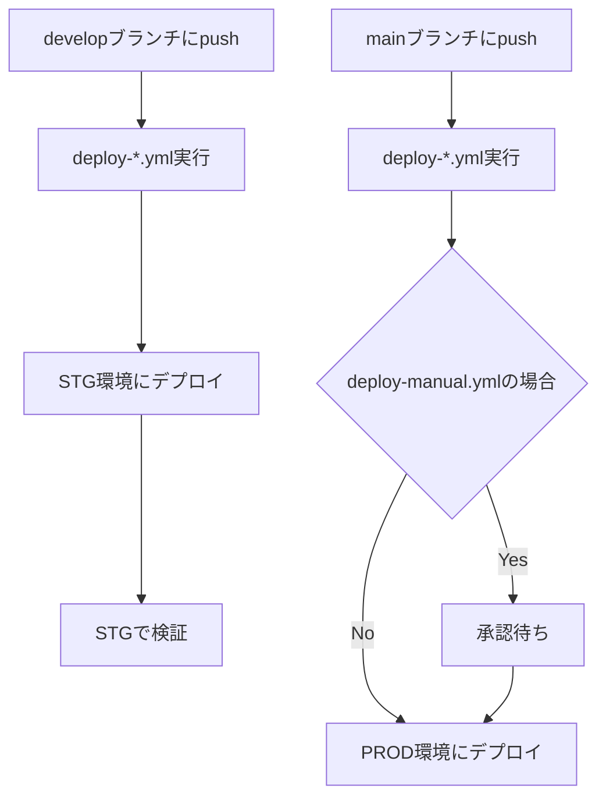

# GitHub Actions - CDK自動デプロイ

## 概要

このディレクトリには、ブランチベースのCDK自動デプロイワークフローが含まれています。
**2つのデプロイワークフロー**（自動 or 手動承認）から選択できます。

## 🚀 デプロイパターン

### ブランチベースのデプロイ

```
develop → Staging環境
main → Production環境
```

**特徴:**
- ✅ ブランチに応じて自動的に環境を判定
- ✅ develop → Staging（自動）
- ✅ main → Production（承認必要 or 自動）
- ✅ シンプルで分かりやすいフロー

### デプロイ順序

```
1. 差分検出 (detect-changes)
   ↓
2. インフラデプロイ (CDK)
   ↓
3. バックエンドデプロイ (ECS)
   ↓
4. DBマイグレーション (Alembic)
```

**重要:** DBマイグレーションは必ずバックエンドデプロイの後に実行されます。新しいコードがデプロイされてから、そのコードに対応するスキーマ変更を適用します。

## 📋 セットアップ手順

### 1. AWS OIDC プロバイダーの設定

#### 1.1 OIDCプロバイダーを作成

```bash
aws iam create-open-id-connect-provider \
  --url https://token.actions.githubusercontent.com \
  --client-id-list sts.amazonaws.com \
  --thumbprint-list 6938fd4d98bab03faadb97b34396831e3780aea1
```

#### 1.2 環境別IAMロールの作成

各環境用のIAMロールを作成します。

**STG環境用ロール (github-actions-stg-role)**

信頼ポリシー:
```json
{
  "Version": "2012-10-17",
  "Statement": [
    {
      "Effect": "Allow",
      "Principal": {
        "Federated": "arn:aws:iam::YOUR_ACCOUNT_ID:oidc-provider/token.actions.githubusercontent.com"
      },
      "Action": "sts:AssumeRoleWithWebIdentity",
      "Condition": {
        "StringEquals": {
          "token.actions.githubusercontent.com:aud": "sts.amazonaws.com"
        },
        "StringLike": {
          "token.actions.githubusercontent.com:sub": "repo:YOUR_ORG/YOUR_REPO:ref:refs/heads/develop"
        }
      }
    }
  ]
}
```

**PROD環境用ロール (github-actions-prod-role)**

信頼ポリシー:
```json
{
  "Version": "2012-10-17",
  "Statement": [
    {
      "Effect": "Allow",
      "Principal": {
        "Federated": "arn:aws:iam::YOUR_ACCOUNT_ID:oidc-provider/token.actions.githubusercontent.com"
      },
      "Action": "sts:AssumeRoleWithWebIdentity",
      "Condition": {
        "StringEquals": {
          "token.actions.githubusercontent.com:aud": "sts.amazonaws.com"
        },
        "StringLike": {
          "token.actions.githubusercontent.com:sub": "repo:YOUR_ORG/YOUR_REPO:ref:refs/heads/main"
        }
      }
    }
  ]
}
```

#### 1.3 各ロールに権限を付与

環境別に適切な権限を付与します：

- **STG:** CDK関連の必要権限（CloudFormation、ECS、RDS、S3など）
- **PROD:** CDK関連の最小権限（本番環境は慎重に）

### 2. GitHub Secretsの設定

リポジトリの Settings → Secrets and variables → Actions で以下を追加：

| Secret名 | 値 | 説明 |
|---------|-----|------|
| `AWS_ROLE_ARN_STG` | `arn:aws:iam::ACCOUNT_ID:role/github-actions-stg-role` | STG環境用IAMロールARN |
| `AWS_ROLE_ARN_PROD` | `arn:aws:iam::ACCOUNT_ID:role/github-actions-prod-role` | PROD環境用IAMロールARN |

### 3. GitHub Environmentsの設定

Settings → Environments で以下の環境を作成：

#### **staging** 環境
- Protection rules: なし（自動デプロイ）
- Environment URL: `https://stg.your-app.com`

#### **production** 環境
- Protection rules:
  - ✅ Required reviewers（承認者を1名以上設定）
  - ✅ Wait timer: 5 minutes（オプション）
- Environment URL: `https://your-app.com`

### 4. AWS Secrets Managerの設定

各環境のデータベース認証情報を保存します：

```bash
# STG環境
aws secretsmanager create-secret \
  --name stg-database-credentials \
  --secret-string '{"username":"your_db_user","password":"your_db_password"}'

# PROD環境
aws secretsmanager create-secret \
  --name prod-database-credentials \
  --secret-string '{"username":"your_db_user","password":"your_db_password"}'
```

### 5. CDKのBootstrap（各環境で初回のみ）

```bash
cd infra

# STG環境
npx cdk bootstrap aws://ACCOUNT_ID/REGION --context envName=stg

# PROD環境
npx cdk bootstrap aws://ACCOUNT_ID/REGION --context envName=prod
```

### 6. CDK設定ファイルの準備

`infra/config/`に各環境の設定ファイルを確認：

- `stg.ts` - ステージング環境設定
- `prod.ts` - 本番環境設定

### 7. デプロイワークフローの選択

#### deploy-auto.yml（自動デプロイ）を使用する場合

以下のワークフローを**有効化**：
- ✅ `deploy-auto.yml`

以下のワークフローを**無効化**：
- ❌ `deploy-manual.yml`

```bash
git mv .github/workflows/deploy-manual.yml .github/workflows/deploy-manual.yml.disabled
git add .github/workflows/
git commit -m "chore: use auto deployment workflow"
git push
```

#### deploy-manual.yml（手動承認付きデプロイ）を使用する場合

以下のワークフローを**有効化**：
- ✅ `deploy-manual.yml`

以下のワークフローを**無効化**：
- ❌ `deploy-auto.yml`

```bash
git mv .github/workflows/deploy-auto.yml .github/workflows/deploy-auto.yml.disabled
git add .github/workflows/
git commit -m "chore: use manual approval deployment workflow"
git push
```

## 🔄 デプロイフロー詳細

### ブランチベースのデプロイ



### デプロイ実行順序

各デプロイジョブは以下の順序で実行されます：

```
1. detect-changes
   - 変更されたファイルを検出
   - デプロイ対象を判定
   ↓
2. deploy-infra
   - CDKでインフラをデプロイ
   - CloudFormation Outputsを取得
   ↓
3. deploy-backend
   - Dockerイメージをビルド・プッシュ
   - ECSサービスを更新
   ↓
4. migrate-database
   - Alembicでマイグレーション実行
   - 新しいコードに対応するスキーマ変更を適用
```

**重要:** DBマイグレーションは必ずバックエンドデプロイ後に実行されます。

## 📝 各ワークフローの詳細

### deploy-auto.yml（自動デプロイ）
- **トリガー:** develop/mainブランチへのpush、または手動実行
- **デプロイ先:** develop → STG、main → PROD
- **承認:** 不要（自動）
- **用途:** 迅速な開発サイクル、即座にデプロイしたい場合
- **特徴:** ブランチに応じて自動的に環境を判定

### deploy-manual.yml（手動承認付きデプロイ）
- **トリガー:** develop/mainブランチへのpush、または手動実行
- **デプロイ先:** develop → STG、main → PROD
- **承認:** Production環境のみ必須（GitHub Environments）
- **用途:** 本番環境への慎重なデプロイ、承認プロセスが必要な場合
- **特徴:** インフラデプロイ前に承認が必要（Production環境のみ）

### backend-ci.yml（CI）
- **トリガー:** PRまたはmainへのpush
- **用途:** バックエンドのLint、アーキテクチャチェック、Dockerビルド

### frontend-ci.yml（CI）
- **トリガー:** PRまたはpush
- **用途:** フロントエンドのJestテスト、ビルドテスト

## 🎯 使用シナリオ

### シナリオ1: 通常の機能追加（STG → PROD）

```bash
# 1. 機能開発
git checkout -b feature/new-feature develop
# ... 開発作業 ...
git commit -m "feat: 新機能"

# 2. developにマージ → STGに自動デプロイ
git checkout develop
git merge feature/new-feature
git push origin develop
# → STG環境に自動デプロイ
# → STGで検証

# 3. mainにマージ → PRODにデプロイ
git checkout main
git merge develop
git push origin main
# → deploy-auto.yml: 自動デプロイ
# → deploy-manual.yml: 承認後デプロイ
```

### シナリオ2: ホットフィックス（直接PROD）

```bash
# 1. mainから緊急修正ブランチ作成
git checkout -b hotfix/critical-bug main
# ... 修正 ...
git commit -m "fix: 緊急バグ修正"

# 2. mainにマージ → PRODにデプロイ
git checkout main
git merge hotfix/critical-bug
git push origin main
# → deploy-auto.yml: 即座にデプロイ
# → deploy-manual.yml: 承認後デプロイ

# 3. developにもマージ
git checkout develop
git merge main
git push origin develop
```

### シナリオ3: 手動デプロイ（任意の環境）

```bash
# GitHub Actions UIから手動実行
# Actions → Deploy (Auto/Manual) → Run workflow
# - Branch: 任意のブランチ
# - environment: stg または prod を選択
# → 指定した環境にデプロイ
```

## 🔧 カスタマイズ

### Slack通知の追加

```yaml
- name: Notify Slack
  if: always()
  uses: slackapi/slack-github-action@v1
  with:
    webhook-url: ${{ secrets.SLACK_WEBHOOK_URL }}
    payload: |
      {
        "text": "Deployment to ${{ env.ENVIRONMENT }}: ${{ job.status }}"
      }
```

### デプロイ前のスモークテスト

```yaml
- name: Run smoke tests
  run: |
    npm run test:smoke -- --env=${{ env.ENVIRONMENT }}
```

### ロールバック機能

```yaml
- name: Create rollback point
  run: |
    aws s3 cp infra/cdk-outputs-prod.json \
      s3://your-backup-bucket/deployments/$(date +%Y%m%d-%H%M%S).json
```

## 🚨 トラブルシューティング

### 問題1: AWS認証エラー

```
Error: Could not assume role with OIDC
```

**解決策:**
1. OIDCプロバイダーが正しく作成されているか確認
2. IAMロールの信頼ポリシーを確認
3. GitHub Secretsが正しく設定されているか確認

### 問題2: Environment承認が表示されない

**解決策:**
1. Settings → Environments → production を確認
2. Required reviewersが設定されているか確認
3. リポジトリの権限を確認

### 問題3: CDK Deploy失敗

```
Error: Stack XXX is in UPDATE_ROLLBACK_COMPLETE state
```

**解決策:**
```bash
# AWSコンソールでスタックを削除するか、
aws cloudformation delete-stack --stack-name XXX
# 再デプロイ
```

### 問題4: 環境設定ファイルが見つからない

```
Error: Cannot find module './config/stg'
```

**解決策:**
`infra/config/stg.ts`を作成：
```typescript
import { EnvironmentConfig } from './environment';
import { devConfig } from './dev';

export const stgConfig: EnvironmentConfig = {
  ...devConfig,
  envName: 'stg',
  // STG固有の設定
};
```

## 🔐 セキュリティのベストプラクティス

### 1. IAMロールの最小権限
- DEV: 開発に必要な権限のみ
- STG: デプロイに必要な権限
- PROD: **厳格な最小権限**

### 2. Environment Protection Rules
```yaml
# 本番環境には必ず設定
environment:
  name: production
  # 承認者を設定
```

### 3. ブランチ保護
- main: 直接pushを禁止、PRレビュー必須
- develop: 直接pushを禁止

### 4. Secretsのローテーション
- 定期的にIAMロールを見直し
- 不要な権限を削除

### 5. 監査ログ
- CloudTrailでAPI呼び出しを記録
- GitHub Actionsのログを保存

## 📊 デプロイワークフロー比較表

| 項目 | deploy-auto.yml | deploy-manual.yml |
|------|-----------------|-------------------|
| 安全性 | ⭐⭐⭐ | ⭐⭐⭐⭐⭐ |
| デプロイ速度 | ⭐⭐⭐⭐⭐ | ⭐⭐⭐ |
| 承認プロセス | なし | Production環境のみ |
| トリガー | Push or Manual | Push or Manual |
| 推奨環境 | 開発スピード優先 | 本番環境への慎重なデプロイ |
| ブランチ判定 | develop → STG<br>main → PROD | develop → STG<br>main → PROD |
| 手動実行 | 可能 | 可能 |

## 📚 参考リンク

- [GitHub Actions - OpenID Connect](https://docs.github.com/ja/actions/deployment/security-hardening-your-deployments/configuring-openid-connect-in-amazon-web-services)
- [AWS CDK Documentation](https://docs.aws.amazon.com/cdk/v2/guide/home.html)
- [GitHub Environments](https://docs.github.com/ja/actions/deployment/targeting-different-environments/using-environments-for-deployment)
- [CDK Best Practices](https://docs.aws.amazon.com/cdk/v2/guide/best-practices.html)

## 🆘 サポート

問題が発生した場合：
1. このREADMEのトラブルシューティングを確認
2. GitHub Actionsのログを確認
3. AWS CloudFormationのイベントを確認
4. チームに相談
