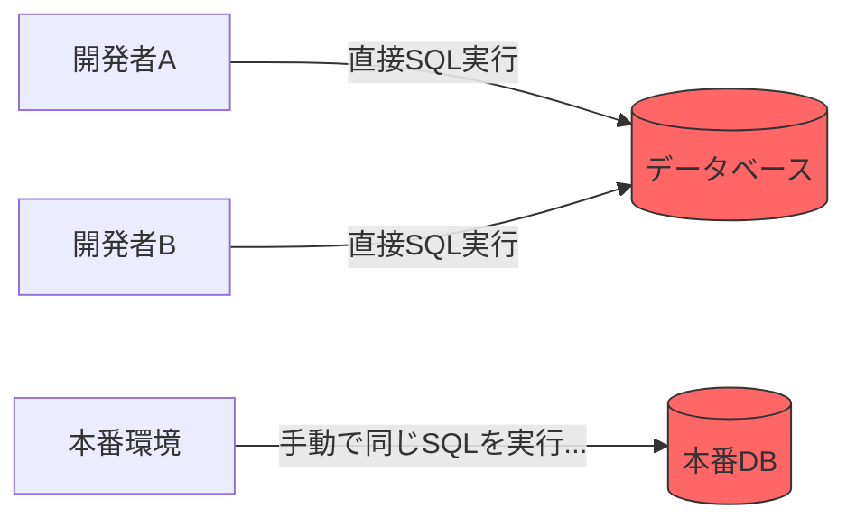
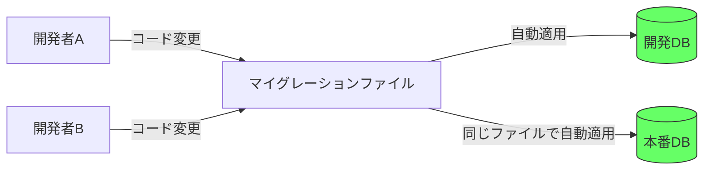
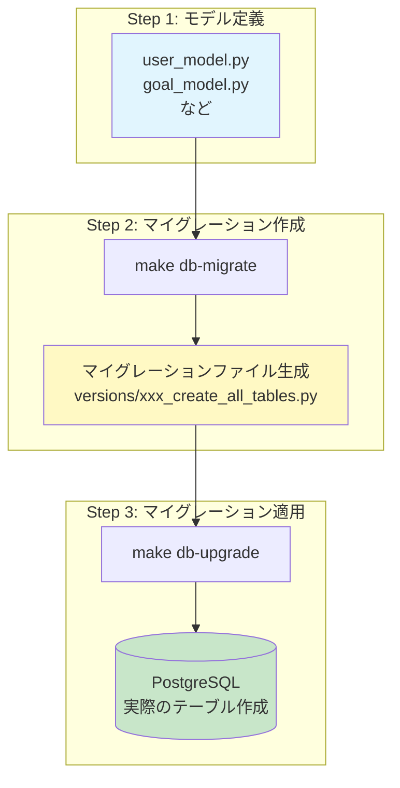
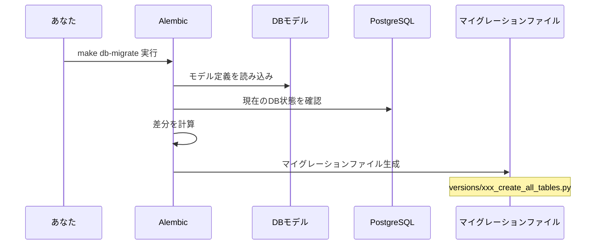
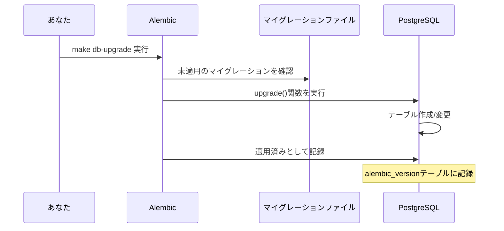
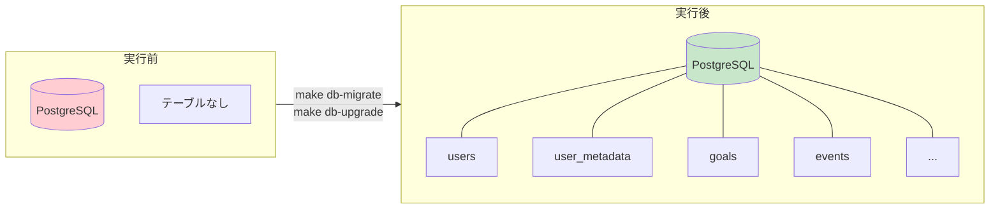
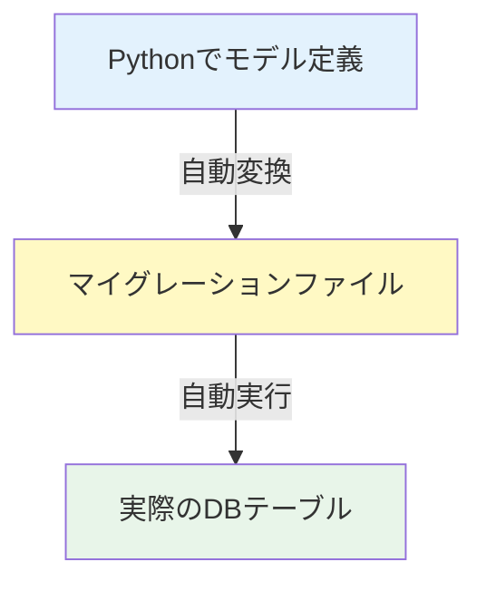

# Alembic マイグレーション入門ガイド

## マイグレーションとは？

**データベースの「設計変更履歴」を管理する仕組み**です。

Gitがコードの変更履歴を管理するように、Alembicはデータベース構造の変更履歴を管理します。

```
コードの世界        →  Git でバージョン管理
データベースの世界  →  Alembic でバージョン管理
```

---

## なぜマイグレーションが必要？

### マイグレーションがない場合



**問題点:**
- 誰がいつ何を変更したか分からない
- 本番環境への反映漏れ
- チームでの共有が困難

### マイグレーションがある場合



**解決:**
- 変更履歴がファイルとして残る
- Gitで共有できる
- どの環境でも同じ手順で適用できる

---

## 全体の流れ



---

## 関連ファイルの構造

```
backend/
├── alembic/
│   ├── env.py              ← Alembicの設定ファイル（モデルを読み込む）
│   ├── versions/           ← マイグレーションファイルが生成される場所
│   │   └── xxx_create_all_tables.py  ← 実行後にここに作成される
│   └── script.py.mako      ← マイグレーションファイルのテンプレート
│
├── alembic.ini             ← Alembicの基本設定
│
└── app/
    └── infrastructure/
        └── db/
            └── models/     ← ここのモデル定義を元にマイグレーションが作られる
                ├── __init__.py
                ├── user_model.py
                ├── goal_model.py
                └── ...
```

---

## 各コマンドの詳細

### `make db-migrate msg='create all tables'`



**何が起きる？**
1. `app/infrastructure/db/models/` のモデル定義を読み込む
2. 現在のデータベースの状態と比較
3. 差分を検出して、マイグレーションファイルを自動生成

**生成されるファイルの例:**
```python
# versions/abc123_create_all_tables.py

def upgrade():
    # DBをアップグレードする処理
    op.create_table('users',
        sa.Column('id', UUID(), primary_key=True),
        sa.Column('email', sa.String(255), nullable=False),
        ...
    )

def downgrade():
    # 元に戻す処理（ロールバック用）
    op.drop_table('users')
```

---

### `make db-upgrade`



**何が起きる？**
1. 未適用のマイグレーションファイルを探す
2. `upgrade()` 関数を実行
3. 実際にデータベースにテーブルが作成される
4. `alembic_version` テーブルに適用済みとして記録

---

## 今回の実行で何が起きるか



**作成されるテーブル一覧:**
- `users` - ユーザー基本情報
- `user_metadata` - ユーザー詳細情報
- `user_visions` - ビジョン
- `user_social_links` - SNSリンク
- `user_rivals` - ライバル関係
- `goals` - 目標
- `events` - イベント
- `event_participants` - イベント参加者
- `title_achievements` - 称号実績
- `attendance_logs` - 参加ログ
- `attendance_summaries` - 参加サマリー
- `attendance_statistics` - 参加統計
- `notifications` - 通知
- `notification_settings` - 通知設定
- `alembic_version` - マイグレーション管理用

---

## よく使うコマンド

| コマンド | 説明 |
|---------|------|
| `make db-migrate msg='xxx'` | マイグレーションファイル作成 |
| `make db-upgrade` | マイグレーション適用 |
| `make db-downgrade` | 1つ前の状態に戻す |
| `make db-current` | 現在のバージョン確認 |
| `make db-history` | マイグレーション履歴確認 |

---

## まとめ



**ポイント:**
- SQLを直接書かなくてOK
- Pythonのモデル定義から自動でDB構造が作られる
- 変更履歴がファイルとして残り、チームで共有できる
- どの環境でも同じコマンドで同じ状態を再現できる
