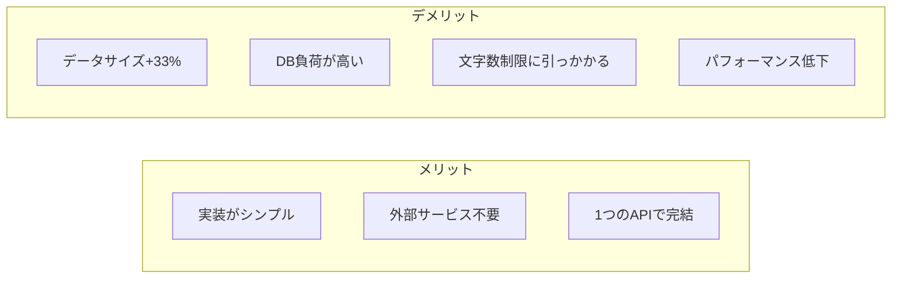
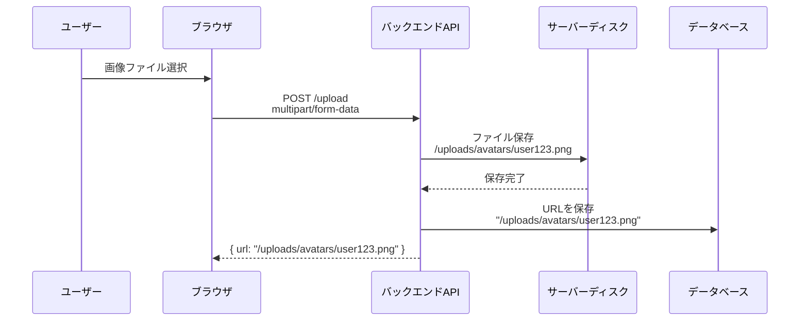
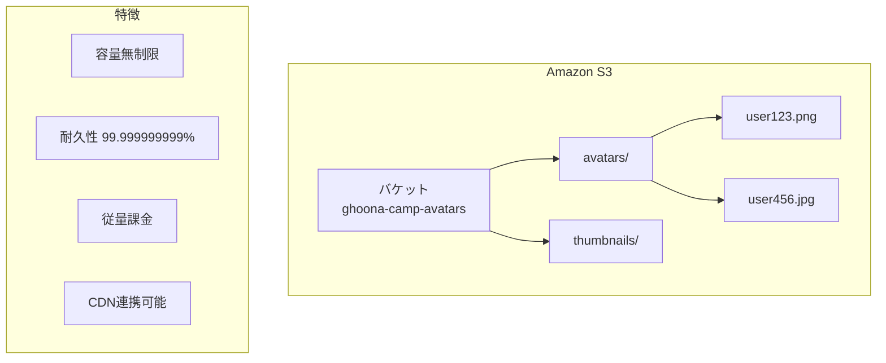
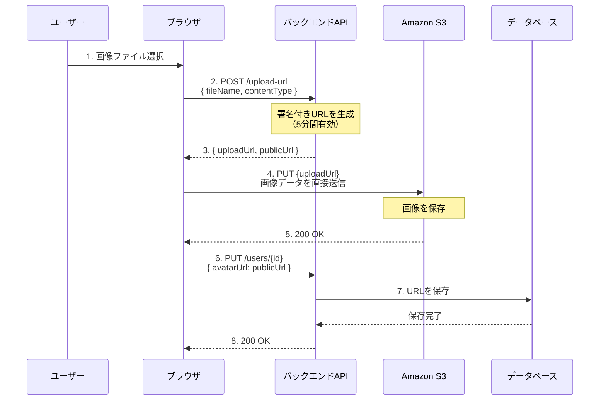
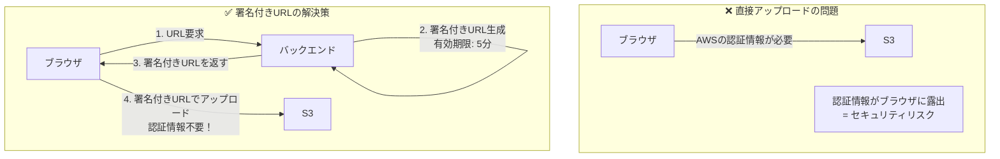
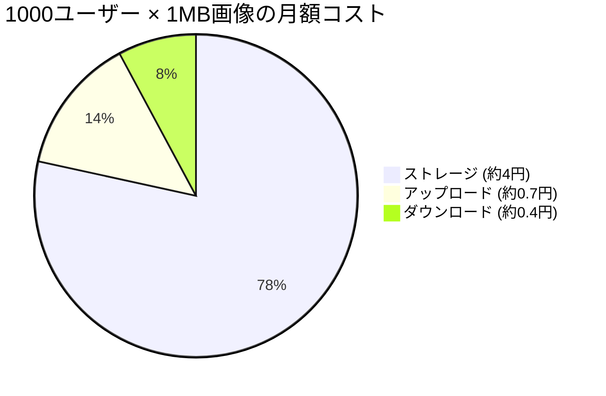
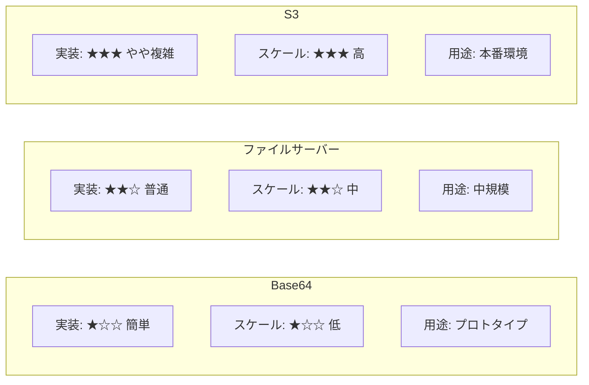
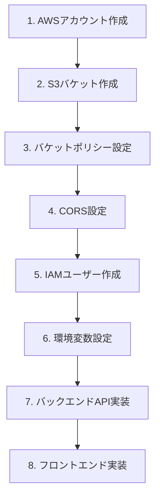
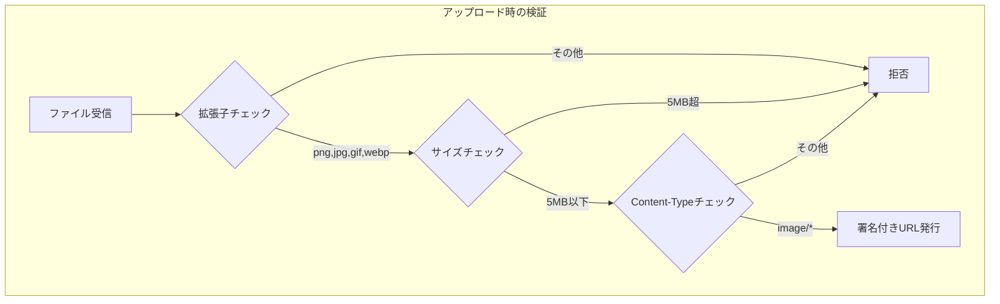
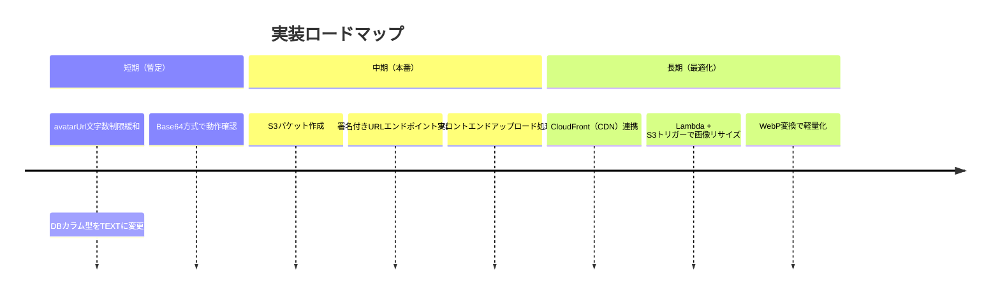

# 画像の保存方式について

## 概要

Webアプリケーションで画像（プロフィール画像など）を扱う場合、いくつかの保存方式があります。それぞれにメリット・デメリットがあり、用途に応じて選択します。

---

## 1. 現在の実装（Base64方式）

### 仕組み

```mermaid
sequenceDiagram
    participant User as ユーザー
    participant Browser as ブラウザ
    participant API as バックエンドAPI
    participant DB as データベース

    User->>Browser: 画像ファイル選択
    Browser->>Browser: Base64エンコード
    Note right of Browser: data:image/png;base64,iVBORw0K...
    Browser->>API: PUT /users/{id}<br/>{ avatarUrl: "data:image/png;base64,..." }
    API->>DB: avatarUrlカラムに保存
    DB-->>API: 保存完了
    API-->>Browser: 200 OK
```

**Base64とは？**
- バイナリデータ（画像など）を文字列に変換する方式
- 例: `data:image/png;base64,iVBORw0KGgoAAAANSUhEUgAA...`

### メリット・デメリット



### 今回のエラー

```json
{
  "type": "string_too_long",
  "loc": ["body", "avatarUrl"],
  "msg": "String should have at most 2000 characters",
  "input": "data:image/png;base64,iVBORw0KGgo..." // 実際は数十万文字
}
```

小さな画像でも数万文字になるため、2000文字制限では足りない。

---

## 2. ファイルサーバー方式

### 仕組み



### メリット・デメリット

| メリット | デメリット |
|---------|-----------|
| DBには短いURLだけ保存 | サーバーのディスク容量に依存 |
| 実装が比較的簡単 | スケールしにくい（サーバー増やすと画像が分散） |
| | サーバー障害で画像が消える可能性 |

---

## 3. S3方式（推奨）

### S3とは？



**Amazon S3 (Simple Storage Service)**
- AWSが提供するオブジェクトストレージサービス
- ファイルを「バケット」という単位で管理

### 仕組み（署名付きURL方式）



### なぜ「署名付きURL」を使うのか？



### コード例

**バックエンド（Python/FastAPI）**
```python
import boto3
from uuid import uuid4

s3_client = boto3.client('s3', region_name='ap-northeast-1')

@router.post("/upload-url")
async def get_upload_url(file_name: str, content_type: str):
    """署名付きアップロードURLを生成"""
    key = f"avatars/{uuid4()}-{file_name}"

    presigned_url = s3_client.generate_presigned_url(
        'put_object',
        Params={
            'Bucket': 'ghoona-camp-avatars',
            'Key': key,
            'ContentType': content_type,
        },
        ExpiresIn=300  # 5分間有効
    )

    public_url = f"https://ghoona-camp-avatars.s3.ap-northeast-1.amazonaws.com/{key}"

    return {"uploadUrl": presigned_url, "publicUrl": public_url}
```

**フロントエンド（TypeScript）**
```typescript
async function uploadAvatar(file: File): Promise<string> {
  // 1. 署名付きURLを取得
  const { uploadUrl, publicUrl } = await api.post('/upload-url', {
    fileName: file.name,
    contentType: file.type,
  });

  // 2. S3に直接アップロード
  await fetch(uploadUrl, {
    method: 'PUT',
    body: file,
    headers: { 'Content-Type': file.type },
  });

  // 3. 公開URLを返す
  return publicUrl;
}
```

### S3の料金目安（東京リージョン）



| 項目 | 料金 |
|------|------|
| ストレージ | $0.025/GB/月（約4円） |
| PUT（アップロード） | $0.0047/1000リクエスト |
| GET（ダウンロード） | $0.00037/1000リクエスト |

---

## 4. 方式比較表



| 方式 | 実装難易度 | スケーラビリティ | コスト | 推奨用途 |
|------|-----------|----------------|--------|---------|
| Base64 | ★☆☆ | ★☆☆ | 無料 | プロトタイプ、小規模 |
| ファイルサーバー | ★★☆ | ★★☆ | サーバー費用 | 中規模、単一サーバー |
| S3 | ★★★ | ★★★ | 従量課金 | 本番環境、大規模 |

---

## 5. S3実装ステップ

### 全体の流れ



### ステップ2: S3バケット作成

```bash
# AWS CLIで作成
aws s3 mb s3://ghoona-camp-avatars --region ap-northeast-1
```

### ステップ3: バケットポリシー設定

```json
{
  "Version": "2012-10-17",
  "Statement": [
    {
      "Sid": "PublicReadGetObject",
      "Effect": "Allow",
      "Principal": "*",
      "Action": "s3:GetObject",
      "Resource": "arn:aws:s3:::ghoona-camp-avatars/avatars/*"
    }
  ]
}
```

### ステップ4: CORS設定

```json
[
  {
    "AllowedHeaders": ["*"],
    "AllowedMethods": ["PUT", "GET"],
    "AllowedOrigins": ["http://localhost:3000", "https://your-domain.com"],
    "ExposeHeaders": []
  }
]
```

### ステップ5: IAMポリシー

```json
{
  "Version": "2012-10-17",
  "Statement": [
    {
      "Effect": "Allow",
      "Action": ["s3:PutObject", "s3:GetObject", "s3:DeleteObject"],
      "Resource": "arn:aws:s3:::ghoona-camp-avatars/*"
    }
  ]
}
```

---

## 6. セキュリティ考慮事項



### 検証コード例

```python
ALLOWED_EXTENSIONS = {'png', 'jpg', 'jpeg', 'gif', 'webp'}
MAX_FILE_SIZE = 5 * 1024 * 1024  # 5MB

def validate_image(file_name: str, file_size: int, content_type: str):
    ext = file_name.rsplit('.', 1)[-1].lower()
    if ext not in ALLOWED_EXTENSIONS:
        raise ValueError("許可されていないファイル形式です")
    if file_size > MAX_FILE_SIZE:
        raise ValueError("ファイルサイズが大きすぎます")
    if not content_type.startswith('image/'):
        raise ValueError("画像ファイルではありません")
```

---

## 7. 今後の実装方針



---

## 参考リンク

- [Amazon S3 公式ドキュメント](https://docs.aws.amazon.com/s3/)
- [Presigned URLs](https://docs.aws.amazon.com/AmazonS3/latest/userguide/using-presigned-url.html)
- [boto3 (Python AWS SDK)](https://boto3.amazonaws.com/v1/documentation/api/latest/index.html)
