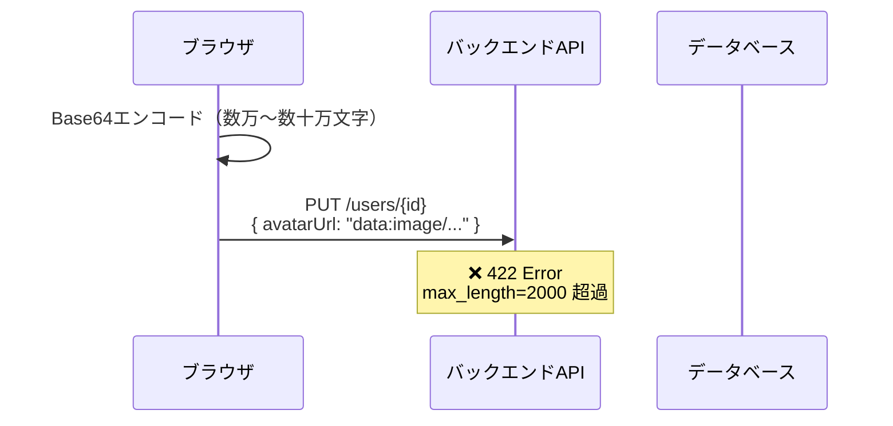
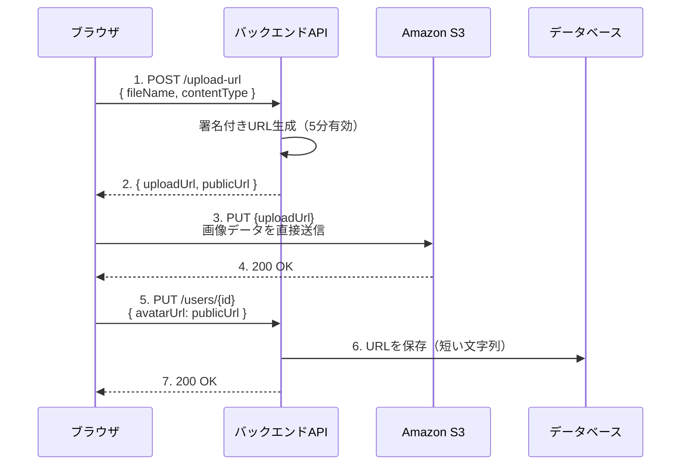
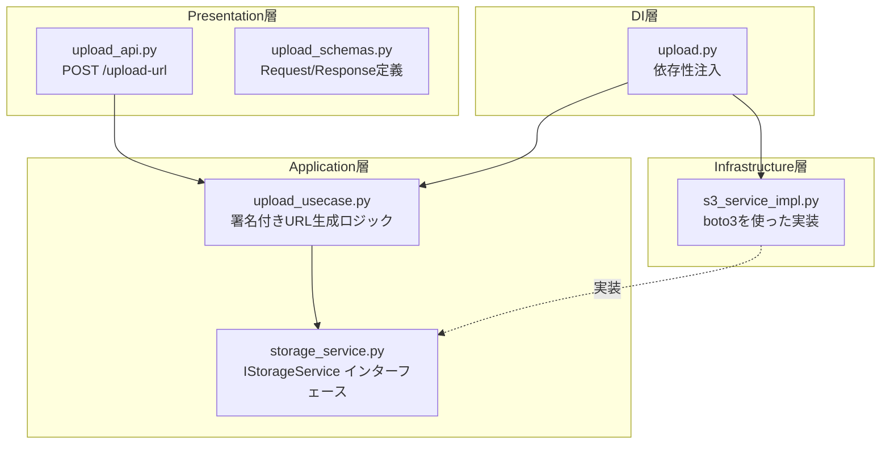
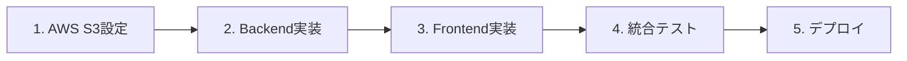

# S3 画像アップロード実装プラン

## 概要

プロフィール画像（avatarUrl）を S3 に保存する機能を実装する。
現在の Base64 方式から、署名付き URL（Presigned URL）方式に移行。

---

## 現状の課題



- Presentation 層の `avatarUrl` が `max_length=2000` に制限
- Base64 画像は数万文字になるため、制限に引っかかる

---

## 解決策：S3 署名付き URL 方式



---

## アーキテクチャ設計

オニオンアーキテクチャに準拠した設計。

### レイヤー構成



---

## 実装ステップ

### Phase 1: バックエンド実装

#### 1.1 Application層 - インターフェース定義

**ファイル**: `backend/app/application/interfaces/storage_service.py`

```python
from abc import ABC, abstractmethod

class IStorageService(ABC):
    """ストレージサービスのインターフェース"""

    @abstractmethod
    def generate_upload_url(
        self,
        file_name: str,
        content_type: str,
        folder: str = "avatars",
    ) -> tuple[str, str]:
        """
        署名付きアップロードURLを生成

        Args:
            file_name: ファイル名
            content_type: MIMEタイプ（image/png など）
            folder: 保存先フォルダ

        Returns:
            tuple[str, str]: (署名付きアップロードURL, 公開URL)
        """
        pass

    @abstractmethod
    def delete_file(self, file_url: str) -> bool:
        """ファイルを削除"""
        pass
```

#### 1.2 Infrastructure層 - S3実装

**ファイル**: `backend/app/infrastructure/storage/s3_service_impl.py`

```python
import boto3
from uuid import uuid4
from app.application.interfaces.storage_service import IStorageService
from app.config import settings

class S3ServiceImpl(IStorageService):
    def __init__(self):
        self.s3_client = boto3.client(
            's3',
            region_name=settings.aws_region,
            aws_access_key_id=settings.aws_access_key_id,
            aws_secret_access_key=settings.aws_secret_access_key,
        )
        self.bucket_name = settings.s3_bucket_name

    def generate_upload_url(
        self,
        file_name: str,
        content_type: str,
        folder: str = "avatars",
    ) -> tuple[str, str]:
        # ユニークなキーを生成
        ext = file_name.rsplit('.', 1)[-1] if '.' in file_name else 'png'
        key = f"{folder}/{uuid4()}.{ext}"

        # 署名付きURLを生成（5分有効）
        presigned_url = self.s3_client.generate_presigned_url(
            'put_object',
            Params={
                'Bucket': self.bucket_name,
                'Key': key,
                'ContentType': content_type,
            },
            ExpiresIn=300,
        )

        # 公開URL
        public_url = f"https://{self.bucket_name}.s3.{settings.aws_region}.amazonaws.com/{key}"

        return presigned_url, public_url

    def delete_file(self, file_url: str) -> bool:
        try:
            # URLからキーを抽出
            key = file_url.split('.amazonaws.com/')[-1]
            self.s3_client.delete_object(Bucket=self.bucket_name, Key=key)
            return True
        except Exception:
            return False
```

#### 1.3 Application層 - ユースケース

**ファイル**: `backend/app/application/use_cases/upload_usecase.py`

```python
from app.application.interfaces.storage_service import IStorageService
from app.application.schemas.upload_schemas import UploadUrlDTO

ALLOWED_CONTENT_TYPES = {'image/png', 'image/jpeg', 'image/gif', 'image/webp'}
MAX_FILE_SIZE = 5 * 1024 * 1024  # 5MB

class UploadUsecase:
    def __init__(self, storage_service: IStorageService):
        self.storage_service = storage_service

    def generate_avatar_upload_url(
        self,
        file_name: str,
        content_type: str,
        file_size: int,
    ) -> UploadUrlDTO:
        # バリデーション
        if content_type not in ALLOWED_CONTENT_TYPES:
            raise ValueError(f"許可されていないファイル形式: {content_type}")

        if file_size > MAX_FILE_SIZE:
            raise ValueError(f"ファイルサイズが大きすぎます（最大5MB）")

        upload_url, public_url = self.storage_service.generate_upload_url(
            file_name=file_name,
            content_type=content_type,
            folder="avatars",
        )

        return UploadUrlDTO(
            upload_url=upload_url,
            public_url=public_url,
        )
```

#### 1.4 Application層 - スキーマ

**ファイル**: `backend/app/application/schemas/upload_schemas.py`

```python
from pydantic import BaseModel

class UploadUrlDTO(BaseModel):
    """アップロードURL DTO"""
    upload_url: str
    public_url: str
```

#### 1.5 Presentation層 - スキーマ

**ファイル**: `backend/app/presentation/schemas/upload_schemas.py`

```python
from pydantic import BaseModel, Field

class GetUploadUrlRequest(BaseModel):
    """署名付きURL取得リクエスト"""
    file_name: str = Field(..., description="ファイル名", max_length=255)
    content_type: str = Field(..., description="MIMEタイプ", max_length=50)
    file_size: int = Field(..., description="ファイルサイズ（バイト）", gt=0)

class GetUploadUrlResponse(BaseModel):
    """署名付きURL取得レスポンス"""
    upload_url: str = Field(..., description="署名付きアップロードURL")
    public_url: str = Field(..., description="公開URL")
```

#### 1.6 Presentation層 - API

**ファイル**: `backend/app/presentation/api/upload_api.py`

```python
from fastapi import APIRouter, Depends, HTTPException
from app.presentation.schemas.upload_schemas import (
    GetUploadUrlRequest,
    GetUploadUrlResponse,
)
from app.application.use_cases.upload_usecase import UploadUsecase
from app.di.upload import get_upload_usecase
from app.presentation.api.auth_api import get_current_user_from_cookie

router = APIRouter(prefix="/api/v1/upload", tags=["upload"])

@router.post("/url", response_model=GetUploadUrlResponse)
def get_upload_url(
    request: GetUploadUrlRequest,
    upload_usecase: UploadUsecase = Depends(get_upload_usecase),
    _current_user = Depends(get_current_user_from_cookie),
) -> GetUploadUrlResponse:
    """署名付きアップロードURLを取得"""
    try:
        result = upload_usecase.generate_avatar_upload_url(
            file_name=request.file_name,
            content_type=request.content_type,
            file_size=request.file_size,
        )
        return GetUploadUrlResponse(
            upload_url=result.upload_url,
            public_url=result.public_url,
        )
    except ValueError as e:
        raise HTTPException(status_code=400, detail=str(e))
```

#### 1.7 DI層

**ファイル**: `backend/app/di/upload.py`

```python
from app.application.use_cases.upload_usecase import UploadUsecase
from app.infrastructure.storage.s3_service_impl import S3ServiceImpl

def get_upload_usecase() -> UploadUsecase:
    storage_service = S3ServiceImpl()
    return UploadUsecase(storage_service=storage_service)
```

#### 1.8 設定追加

**ファイル**: `backend/app/config.py` に追加

```python
class Settings(BaseSettings):
    # ... 既存設定 ...

    # AWS S3
    aws_region: str = "ap-northeast-1"
    aws_access_key_id: str = ""
    aws_secret_access_key: str = ""
    s3_bucket_name: str = ""
```

**ファイル**: `backend/.env` に追加

```env
# AWS S3
AWS_REGION=ap-northeast-1
AWS_ACCESS_KEY_ID=your-access-key
AWS_SECRET_ACCESS_KEY=your-secret-key
S3_BUCKET_NAME=ghoona-camp-avatars
```

#### 1.9 依存関係追加

**ファイル**: `backend/requirements.txt` に追加

```
boto3==1.35.0
```

#### 1.10 ルーター登録

**ファイル**: `backend/app/main.py`

```python
from app.presentation.api.upload_api import router as upload_router

app.include_router(upload_router)
```

---

### Phase 2: フロントエンド実装

#### 2.1 API クライアント

**ファイル**: `frontend/src/shared/api/upload/upload-api.ts`

```typescript
import { httpClient } from '../client/http-client';

export interface GetUploadUrlRequest {
  fileName: string;
  contentType: string;
  fileSize: number;
}

export interface GetUploadUrlResponse {
  uploadUrl: string;
  publicUrl: string;
}

export const uploadApi = {
  getUploadUrl: async (
    request: GetUploadUrlRequest,
  ): Promise<GetUploadUrlResponse> => {
    const response = await httpClient.post<GetUploadUrlResponse>(
      '/api/v1/upload/url',
      {
        file_name: request.fileName,
        content_type: request.contentType,
        file_size: request.fileSize,
      },
    );
    return response.data;
  },
};
```

#### 2.2 アップロードユーティリティ

**ファイル**: `frontend/src/shared/lib/upload/upload-to-s3.ts`

```typescript
import { uploadApi } from '@/shared/api/upload/upload-api';

export async function uploadImageToS3(file: File): Promise<string> {
  // 1. 署名付きURLを取得
  const { uploadUrl, publicUrl } = await uploadApi.getUploadUrl({
    fileName: file.name,
    contentType: file.type,
    fileSize: file.size,
  });

  // 2. S3に直接アップロード
  const response = await fetch(uploadUrl, {
    method: 'PUT',
    body: file,
    headers: {
      'Content-Type': file.type,
    },
  });

  if (!response.ok) {
    throw new Error('画像のアップロードに失敗しました');
  }

  // 3. 公開URLを返す
  return publicUrl;
}
```

#### 2.3 AvatarField の修正

**ファイル**: `frontend/src/shared/ui/form-fields/ui/AvatarField.tsx`

```typescript
'use client';

import { useRef, useState } from 'react';
import { Camera, User, Loader2 } from 'lucide-react';
import { cn } from '@/shared/ui/shadcn/lib/utils';
import { uploadImageToS3 } from '@/shared/lib/upload/upload-to-s3';

export interface AvatarFieldProps {
  id: string;
  value: string | null;
  onChange: (value: string | null) => void;
  disabled?: boolean;
  className?: string;
}

export function AvatarField({
  id,
  value,
  onChange,
  disabled,
  className,
}: AvatarFieldProps) {
  const inputRef = useRef<HTMLInputElement>(null);
  const [isUploading, setIsUploading] = useState(false);

  const handleFileChange = async (e: React.ChangeEvent<HTMLInputElement>) => {
    const file = e.target.files?.[0];
    if (!file) return;

    try {
      setIsUploading(true);
      const publicUrl = await uploadImageToS3(file);
      onChange(publicUrl);
    } catch (error) {
      console.error('Upload failed:', error);
      // TODO: エラーハンドリング（toast表示など）
    } finally {
      setIsUploading(false);
    }
  };

  return (
    <div className={cn('relative', className)}>
      {/* グラデーション背景 */}
      <div className='h-24 rounded-t-lg bg-gradient-to-br from-primary via-primary/40 to-primary/5' />

      {/* アバター */}
      <div className='absolute left-1/2 top-12 -translate-x-1/2'>
        <button
          type='button'
          onClick={() => inputRef.current?.click()}
          disabled={disabled || isUploading}
          className='group relative size-24 overflow-hidden rounded-full bg-background shadow-raised disabled:cursor-not-allowed'
        >
          {value ? (
            
          ) : (
            <div className='flex size-full items-center justify-center bg-muted'>
              <User className='size-10 text-muted-foreground' />
            </div>
          )}

          {/* オーバーレイ */}
          <div className='absolute inset-0 flex items-center justify-center bg-black/50 opacity-0 transition-opacity group-hover:opacity-100'>
            {isUploading ? (
              <Loader2 className='size-6 animate-spin text-white' />
            ) : (
              <Camera className='size-6 text-white' />
            )}
          </div>
        </button>
      </div>

      <div className='h-14' />

      <input
        ref={inputRef}
        id={id}
        type='file'
        accept='image/png,image/jpeg,image/gif,image/webp'
        onChange={handleFileChange}
        disabled={disabled || isUploading}
        className='hidden'
      />
    </div>
  );
}
```

---

### Phase 3: インフラ設定（AWS）

#### 3.1 S3 バケット作成

```bash
aws s3 mb s3://ghoona-camp-avatars --region ap-northeast-1
```

#### 3.2 バケットポリシー

```json
{
  "Version": "2012-10-17",
  "Statement": [
    {
      "Sid": "PublicReadAvatars",
      "Effect": "Allow",
      "Principal": "*",
      "Action": "s3:GetObject",
      "Resource": "arn:aws:s3:::ghoona-camp-avatars/avatars/*"
    }
  ]
}
```

#### 3.3 CORS 設定

```json
[
  {
    "AllowedHeaders": ["*"],
    "AllowedMethods": ["PUT", "GET"],
    "AllowedOrigins": [
      "http://localhost:3000",
      "https://your-domain.com"
    ],
    "ExposeHeaders": []
  }
]
```

#### 3.4 IAM ポリシー（バックエンド用）

```json
{
  "Version": "2012-10-17",
  "Statement": [
    {
      "Effect": "Allow",
      "Action": [
        "s3:PutObject",
        "s3:GetObject",
        "s3:DeleteObject"
      ],
      "Resource": "arn:aws:s3:::ghoona-camp-avatars/*"
    }
  ]
}
```

---

## ファイル構成まとめ

### バックエンド（新規作成）

```
backend/app/
├── application/
│   ├── interfaces/
│   │   └── storage_service.py      # NEW
│   ├── schemas/
│   │   └── upload_schemas.py       # NEW
│   └── use_cases/
│       └── upload_usecase.py       # NEW
├── infrastructure/
│   └── storage/
│       ├── __init__.py             # NEW
│       └── s3_service_impl.py      # NEW
├── presentation/
│   ├── api/
│   │   └── upload_api.py           # NEW
│   └── schemas/
│       └── upload_schemas.py       # NEW
├── di/
│   └── upload.py                   # NEW
├── config.py                       # MODIFY（AWS設定追加）
└── main.py                         # MODIFY（ルーター追加）
```

### フロントエンド（新規・修正）

```
frontend/src/
├── shared/
│   ├── api/
│   │   └── upload/
│   │       └── upload-api.ts       # NEW
│   ├── lib/
│   │   └── upload/
│   │       └── upload-to-s3.ts     # NEW
│   └── ui/
│       └── form-fields/
│           └── ui/
│               └── AvatarField.tsx # MODIFY
```

---

## テスト計画

### 単体テスト

1. `UploadUsecase` のバリデーションテスト
   - 許可されていないContent-Type → エラー
   - ファイルサイズ超過 → エラー
   - 正常なリクエスト → URL生成成功

2. `S3ServiceImpl` のモックテスト
   - boto3 をモック化してテスト

### 統合テスト

1. `/api/v1/upload/url` エンドポイント
   - 認証なし → 401
   - 不正なリクエスト → 400
   - 正常なリクエスト → 200 + URL返却

### E2Eテスト

1. プロフィール画面で画像選択 → S3アップロード → URL保存 → 画像表示

---

## セキュリティ考慮事項

1. **認証必須**: `/upload/url` は認証済みユーザーのみ
2. **ファイル検証**: Content-Type とサイズをサーバー側でバリデーション
3. **署名付きURLの有効期限**: 5分間のみ有効
4. **バケットポリシー**: avatars フォルダのみ公開読み取り可能
5. **IAM最小権限**: バックエンドには必要最小限の権限のみ付与

---

## 実装順序



1. **AWS S3 設定** - バケット作成、CORS、IAM
2. **Backend 実装** - Phase 1 の手順に従って実装
3. **Frontend 実装** - Phase 2 の手順に従って実装
4. **統合テスト** - ローカル環境で動作確認
5. **デプロイ** - 環境変数設定、本番デプロイ
